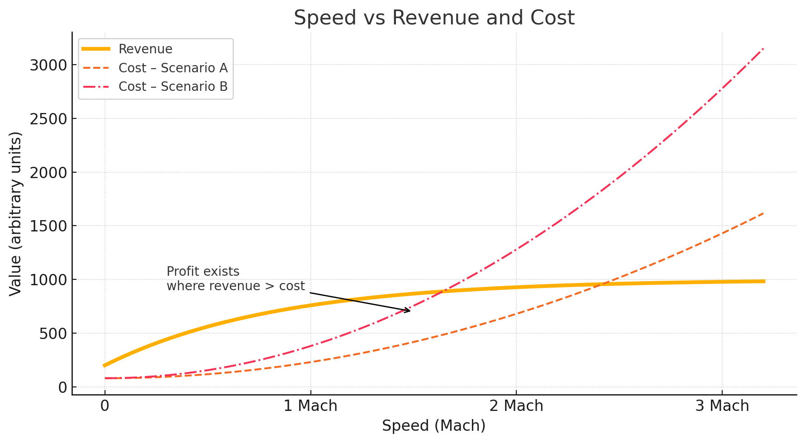
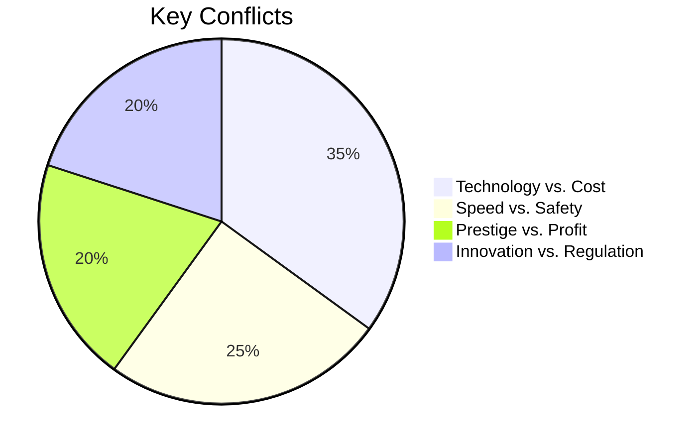

# The Supersonic Race

{.hidden}

Peaks of Technology

  
    Group 1 - 6/15/2025
  

---
transition: slide-left
hideInToc: true
---

# Table of Content

<Toc text-sm minDepth="1" maxDepth="1" />

---
layout: section
transition: slide-up
level: 1
---

# Before the Story

---
level: 2
transition: slide-up
---

# 1953

## Why we start the supersonic transportation?

After the breaking of sonic speed on

- F-100
- MiG-19

People see the potential of commercial supersonic airline.

---
layout: image
image: speed-vs-revenue-and-cost.png
transition: slide-up
---

{.hidden}

---
level: 2
layout: two-cols
title: Fuel Price
transition: slide-up
---

# In the Pass

Fuel cost is so low. Not even showing in finical report.

::right::

# Right Now

Flight operations = Fuel + Workers Payout

---
level: 2
transition: slide-up
---

# American SST Concepts

{width=680px}

---
layout: section
transition: slide-up
level: 1
---

# The Apex and Traps of Technical Design

## Technical Design Issues

---
level: 1
hideInToc: true
transition: slide-up
---

* The Limit Challenge of Materials and Thermodynamics
* The "Transformation" of Aerodynamic Design
* The "Dynamic Balance" of Mechanical Systems

* Technical Highlights
  * The Concorde's "supersonic cruise" capability and "breaking the Earth's rotational speed"
  * The Tu-144's was the first to achieve supersonic commercial flight
* Technical Failures
  * Material choices
  * The complexity of the mechanical systems

---
level: 2
transition: slide-up
---

# The Limit Challenge of Materials and Thermodynamics

- The "Heat" Dilemma of Aluminum Alloy
- The "Fire" Crisis of the Fuel System

---
level: 2
transition: slide-up
---

# The "Transformation" of Aerodynamic Design

* The "Tripartite" of Wings
* The "Transformation" Philosophy of the Nose

---
level: 2
transition: slide-up
---

# The "Dynamic Balance" of Mechanical Systems

* The "Weight Game" of Fuel Distribution
  * dynamically adjust its center of gravity through 11 fuel tanks

* The "Patchwork Philosophy" of Engines
  *  Rolls-Royce designed a variable inlet for the Concorde
  *  this system required real-time computer control

---
layout: two-cols
level: 2
transition: slide-up
layoutClass: gap-16
title: Technical Highlights/Failures
---

# Highlights

* The Concorde's "supersonic cruise" capability (2.04 Mach) and "breaking the Earth's rotational speed"
* The Tu-144's "high fuel consumption" and "small winglets" design were crude, but it was the first to achieve supersonic commercial flight

::right::

# Failures

* Material choices limited the Concorde's maximum speed (2179 km/h), while the Tu-144's structural weakness led to a crash at the Paris Air Show
* The complexity of the mechanical systems made maintenance costs extremely high, ultimately making it a symbol of "luxury aviation."

---
layout: section
level: 1
transition: slide-up
---

# The Domino Effect of Non-technical Issues

## Non-Technical Issues

---
level: 1
hideInToc: true
transition: slide-up
---

* The "Double-edged Sword" of Economy and Market
* The "Invisible Driver" of Politics and the Cold War
* The "Invisible Barrier" of Society and Culture

* Non-technical Lessons:
  * Even the most advanced technology will fail if it cannot solve economic viability and public acceptance
  * Projects driven by Cold War politics often ignore commercial logic

---
level: 2
transition: slide-up
---

# The "Double-edged Sword" of Economy and Market

- **The "Deadly Strike" of Oil Prices**: From low prices in 1950s to 8x cost increase after 1970s crisis
- **The "Bubble" of Ticket Prices**: 20x price premium with limited passenger numbers

---
level: 2
transition: slide-up
---

# The "Invisible Driver" of Politics and the Cold War

- **De Gaulle's "Political Gamble"**: National prestige over commercial logic
- **US "Regulatory Barrier"**: Banned from domestic routes
  - Due to sonic boom
  - Or political reason

---
level: 2
transition: slide-up
---

# The "Invisible Barrier" of Society and Culture

- **Noise and Environment Controversy**: Sonic boom protests
- **Public Safety Crisis**: 2000 crash damaged trust

---
layout: section
level: 1
transition: slide-up
---

# Risk Assessment and the Safety Dilemma

---
level: 1
hideInToc: true
transition: slide-up
---

* Main Risks:
  * Fuel system explosion risk
  * Structural failure risk
  * Chain reaction of accidents

* Risk Response Strategies:
  * Material upgrades (abandoned titanium)
  * Safety redundancy design
  * Policy avoidance measures

* Risk Warning:
  * Combination of technical and human risks proved unsustainable

---
level: 2
transition: slide-up
---

# Main Risks

---
level: 2
transition: slide-up
---

# Risk Response Strategies

- **Material Upgrade**: Titanium alloy rejected due to cost
- **Safety Redundancy**: Fuel isolation layers added post-2000
- **Policy Avoidance**: Restricted to transatlantic routes

---
layout: section
level: 1
transition: slide-up
---

# The Battlefield of Stakeholders

---
level: 1
hideInToc: true
transition: slide-up
---

* Engineers vs. Physical Limits
* Governments vs. Economic Reality
* Airlines vs. Operating Costs
* Public vs. Environmental Impact
* History vs. Future Possibilities

---
level: 2
transition: slide-up
---

# Stakeholder Conflicts

---
layout: section
level: 1
transition: slide-up
---

# Lessons from History and Future Prospects

---
level: 2
transition: slide-up
---

# Common Reasons for Failure

- Economic Unsustainability
- Imbalance Between Technology and Cost
- Political Overreach

---
level: 2
transition: slide-up
---

# The Legacy of Success

- Advanced materials research
- Aerodynamic breakthroughs
- Safety standard improvements

---
level: 2
transition: slide-up
---

# Future Possibilities

- New energy technologies
- Cost control through modular design
- Revised regulatory frameworks

---
layout: statement
transition: fade
---

# Technological breakthroughs must resonate with the needs of the era

---
layout: end
transition: fade
title: Q&A
---

# Thank You

  
    Q&A
  

